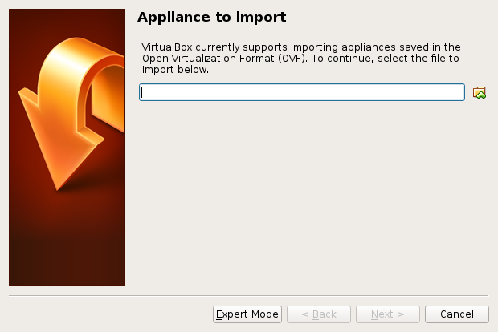
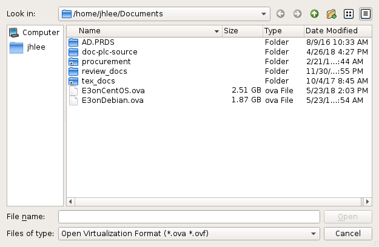
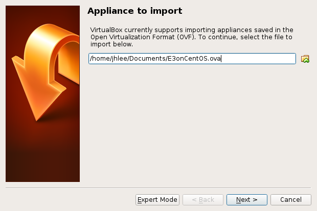
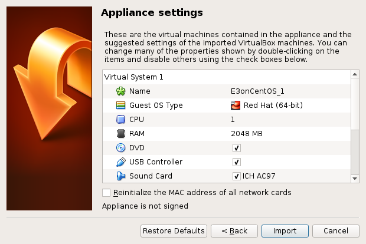
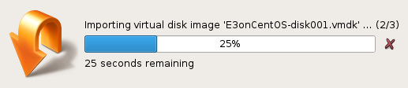
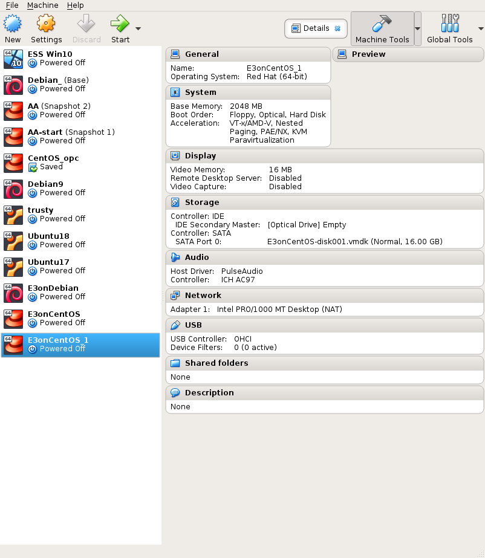
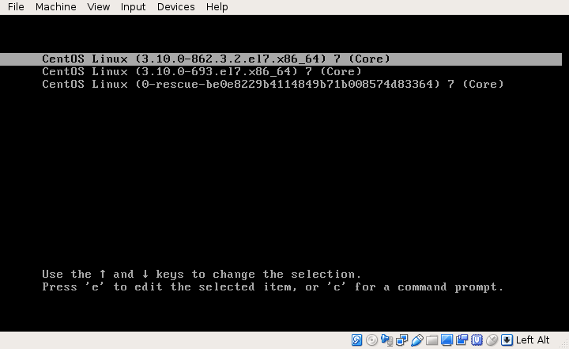

# Step 0

## Download one OS

Download the prefered OS via the one of the following links :

* CentOS 7.4
  https://artifactory.esss.lu.se/artifactory/list/ioc-rootfs/E3onCentOS.ova

* CentOS 7.5
  https://artifactory.esss.lu.se/artifactory/list/ioc-rootfs/E3onCentOS7.5.ova

* Debian 9 
  https://artifactory.esss.lu.se/artifactory/list/ioc-rootfs/E3onDebian.ova

# Step 1

## Run the VirtualBox

## File > Import Appliance 

## Select E3on*.ova file

## Next 

## Check Appliance settings

Mostly, click *Import*

## Running and Done!

## Select E3onCentOS, Show

# Step 2

 * The user account is *iocuser*
 * If one knows its password, please try it.
 * If one doesn't know it, please contact me directly
