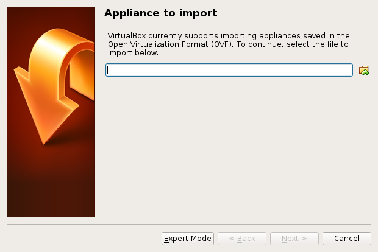
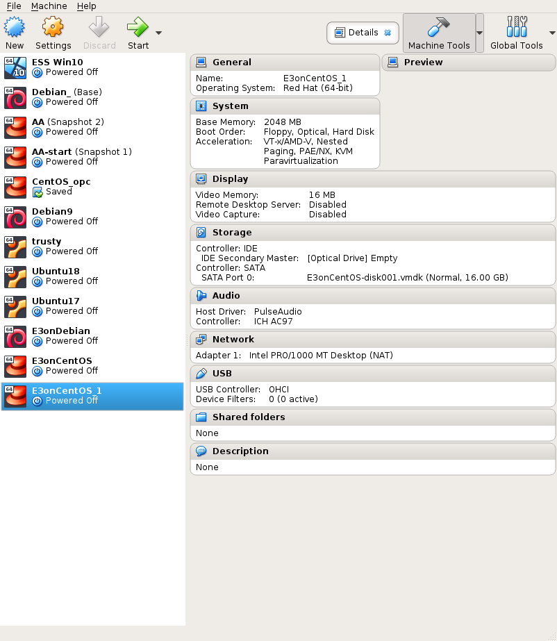

# Step 0

## Download one OS

Download the prefered OS via the one of the following links :

* https://artifactory.esss.lu.se/artifactory/list/ioc-rootfs/E3onCentOS.ova

* https://artifactory.esss.lu.se/artifactory/list/ioc-rootfs/E3onDebian.ova

# Step 1

## Run the VirtualBox

## File > Import Appliance 

## Select E3on*.ova file

## Next 

## Check Appliance settings

Mostly, click *Import*

## Running and Done!

