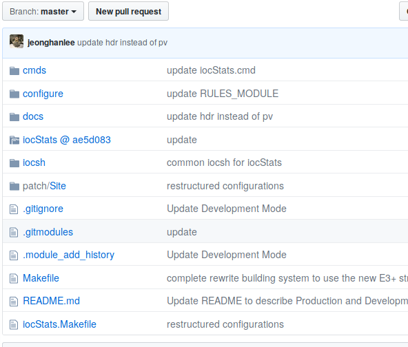

Chapter 5 : Take the Deployment or the Development
==

## Lesson Overview
In this lesson, you'll learn how to do the following:
* Understand why e3 doesn't hold any source codes
* Understand the anatomy of e3 module directory
* Understand the Deployment Mode through git submodule
* Understand the Development Mode through git clone
* Understand two repositories within e3 
* Understand why there is a Patch path within e3


## No Source Codes, Yes Configuration Files!
By default, each e3 module and application has no source codes within e3-module repository, but it only has the e3 configuration files and additional files. These files allow us to build the consistent user environment and building rules in terms of source codes, modules, applications, kernel drivers, and so on, which we may get from anywhere in any forms. 

Therefore, e3 doesn't care each single change in a source code repository, but care much about a snapshot (an interesting release version) which will be selected by one of release versions, user requests, or both. For example, at t=t0, we select the stream 2.7.14 version as the stable release within e3. At t=t1, we will select the stream 2.8.8, because a subsystem needs it. At this moment, we don't care about 2.8.0, 2.8.1, 2.8.2, 2.8.3, 2.8.4, 2.8.5, 2.8.6, and 2.8.7. We don't need to sync their changes into a master branch of a local repository, which we have to clone or fork. Simply, we don't need to do any maintenance jobs. The concept is that to select what we would like to use when we need it. In Atomic Physics, it is the similar concept of an atomic electron transition [1], which is a change of an electron from one energy level to another, which is known as quantum jump or quantum leap. Once e3 has the absorption of energies from user requests, it will release **jumps** version of each module. This approach is called as **Quantized or Quantum Release**. We will describe how we release a specific version of e3 module in [Chapter 11](chapter11.md).

Currently, it actually reduces unnecessary maintenance works to sync source code repositories and allows one single maintainer to use his valuable time to focus e3 functionalities instead of them. However, an e3 module can hold source files also, is known as *local* mode, which will be discussed later. 


## Anatomy

Please go **E3_TOP**/e3-iocStats, and run the following command:

```
e3-iocStats (master)$ tree -L 1
.
├──  cmds
├──  configure
├──  docs
├──  iocsh
├──  iocStats
├──  iocStats.Makefile
├──  Makefile
├──  patch
└──  README.md
```


Each module has the slightly difference directory structure and files, but most of them are the same. 

* cmds              : customized startup scripts should be located in
* docs              : documents, log fles or others should be located in
* iocsh             : modularized startup scripts should be located in. They will be installed into e3 installation path. 
* patch             : if we need to handle small changes of source codes, we can keep patch files within it. 
* Makefile          : global e3 module makefile 
* iocStats.Makefile : e3 makefile for iocStats
* configure         : e3 configuration files
* iocStats          : git submodule path to link to where iocStats source reposiotory is

### Git submodule

In order to explain how e3 uses git submodules, we have to do the following execise:

0. Run

```
$ git submodule status
```
One may get the following output:
```
ae5d08388ca3d6c48ec0e37787c865c5db18dc8f iocStats (3.1.15-17-gae5d083)
```
Please spend some time to understand these three columns. The reference [2] may be useful. 

1. Check a github site

Please visit https://github.com/icshwi/e3-iocStats, which is shown in **Figure 1**.
The magic number is **ae5d083**. Please try to find where that number exists. After finding it, please check that number in the output of `git submodule status` also. 

||
| :---: |
|**Figure 1** The screenshot for the iocStats github site. |


2. Check its submodule configuration

```
$ more .gitmodules
[submodule "iocStats"]
        path = iocStats
        url = https://github.com/epics-modules/iocStats
        ignore = dirty
```

## Deployment Mode

As one sees now, `git  submodule` guides us to a new place where we can work and a new way to handle many different source files which are scattered over many difference facilities. However, in order to use it fully, one should have the proper permission and learn how it works precisely. With the current implementation and limited resources, we cannot use this rich features fully. Thus, e3 will use its minimal feature, which is related with the **magic** number that is the short version of the SHA-1 checksum by git [4]. 

Therefore, we only use a specific commit version of iocStats within e3-iocStats in order to identify which version currently links to. And if source code repositories are stable enough, we can use `git submodule update --init` to download its specific version of source codes within e3 modules. By that means, we can pick a specific version of a module, which we would like to use for stable e3 system. 

However, when source code repositories are changed very frequently, it also create an additional maintenance work which one has to update the SHA-A checksum in order to match a selected version of a module. Thus, with `make init`, it will download latest version of a module, and switch to a specific version defined in `configure/CONFIG_MODULE` through several git and other commands behind its building system. 

The following commands are used for the deployment mode of each module. They will use `git submodule` path to do their jobs properly. 

```
$ make vars
$ make init
$ make patch
$ make build
$ make install
$ make existent
$ make clean
```


## Development Mode

The deployment mode is nice if one has enough domain knowledge on `git submodule` and proper permission on a source repository. As one knows, it is not always the case where we work on Earth. Thus, the e3 has the development mode, which resolve these conflicts by using `git clone`. Please look at `configure` path. One can find few files have the suffix `_DEV`.

```
$ ls configure/*_DEV
```

Two files (`CONFIG_MODULE_DEV` and `RELEASE_DEV`) are the counterpart of files (`CONFIG_MODULE` and `RELEASE`) in the deployment mode. Both files are almost identifical except the suffix `_DEV` and following things in the development mode :

* `E3_MODULE_DEV_GITURL` : This shows the repository which one would like to download into an e3 module
* `E3_MODULE_SRC_PATH` : This shows the source codes path for the deployment mode. It has the suffix `-dev`. For example, e3-iocStats has `iocStats` source path in the deployment, and `iocStats-dev` one in the development mode. 

With `E3_MODULE_DEV_GITURL` variable in `configure/CONFIG_MODULE_DEV` with the most poweful feature of `git`, we may have a plenty of degree of freedom to develop an module without worrying about other system which may use this module. 


The following commands are used for the development mode of each module. They will use `git clone` path to do their jobs properly. There is one extra command which one can see `make devdistclean` will remove the clone source directory, for example, iocStats-dev when one would like to clone from scratch. And `make existent` and `make devexistent` are the same output, because it relys on **installed** module versions. 

```
$ make devvars
$ make devinit
$ make devpatch
$ make devbuild
$ make devinstall
$ make devexistent
$ make devclean
$ make devdistclean
```

### Git clone

0. Fork your own copy from the community iocStats [5]

1. Update the `E3_MODULE_DEV_GITURL` in order to use your own repository. For example, the default one is `https://github.com/icshwi/iocStats`

2. Check https://github.com/icshwi/iocStats whether it is the same as the original one or not. One can see the following line `This branch is 1 commit ahead, 1 commit behind epics-modules:master. ` in **Figure 2**.

||
| :---: |
|**Figure 2** The screenshot for the forked and modified icshwi iocStats github site. |


3. `make devvars`

This will show the e3 module variables with the development mode. 
```
$ make devvars
e3-iocStats$ make devvars

------------------------------------------------------------
>>>>     Current EPICS and E3 Envrionment Variables     <<<<
------------------------------------------------------------

E3_MODULES_INSTALL_LOCATION = /epics/base-3.15.5/require/3.0.4/siteMods/iocStats/jhlee
E3_MODULES_INSTALL_LOCATION_BIN = /epics/base-3.15.5/require/3.0.4/siteMods/iocStats/jhlee/bin
E3_MODULES_INSTALL_LOCATION_BIN_LINK = /epics/base-3.15.5/require/3.0.4/siteLibs/iocStats_jhlee_bin
E3_MODULES_INSTALL_LOCATION_DB = /epics/base-3.15.5/require/3.0.4/siteMods/iocStats/jhlee/db
E3_MODULES_INSTALL_LOCATION_DBD_LINK = /epics/base-3.15.5/require/3.0.4/siteLibs/iocStats.dbd.jhlee
E3_MODULES_INSTALL_LOCATION_DB_LINK = /epics/base-3.15.5/require/3.0.4/siteLibs/iocStats_jhlee_db
E3_MODULES_INSTALL_LOCATION_INC = /epics/base-3.15.5/require/3.0.4/siteMods/iocStats/jhlee/include
E3_MODULES_INSTALL_LOCATION_INC_LINK = /epics/base-3.15.5/require/3.0.4/siteLibs/iocStats_jhlee_include
E3_MODULES_INSTALL_LOCATION_LIB = /epics/base-3.15.5/require/3.0.4/siteMods/iocStats/jhlee/lib
E3_MODULES_INSTALL_LOCATION_LIB_LINK = /epics/base-3.15.5/require/3.0.4/siteLibs/iocStats_jhlee_lib
E3_MODULES_LIBLINKNAME = libiocStats.so.jhlee
E3_MODULES_LIBNAME = libiocStats.so
E3_MODULES_PATH = /epics/base-3.15.5/require/3.0.4/siteMods
E3_MODULES_VENDOR_LIBS_LOCATION = /epics/base-3.15.5/require/3.0.4/siteLibs/vendor/iocStats/jhlee
E3_MODULE_DEV_GITURL = "https://github.com/icshwi/iocStats"
E3_MODULE_MAKEFILE = iocStats.Makefile
E3_MODULE_MAKE_CMDS = make -C iocStats-dev -f iocStats.Makefile LIBVERSION="jhlee" PROJECT="iocStats" EPICS_MODULES="/epics/base-3.15.5/require/3.0.4/siteMods" EPICS_LOCATION="/epics/base-3.15.5" BUILDCLASSES="Linux" E3_SITEMODS_PATH="/epics/base-3.15.5/require/3.0.4/siteMods" E3_SITEAPPS_PATH="/epics/base-3.15.5/require/3.0.4/siteApps" E3_SITELIBS_PATH="/epics/base-3.15.5/require/3.0.4/siteLibs"
E3_MODULE_NAME = iocStats
E3_MODULE_SRC_PATH = iocStats-dev
E3_MODULE_VERSION = jhlee
E3_REQUIRE_CONFIG = /epics/base-3.15.5/require/3.0.4/configure
E3_REQUIRE_TOOLS = /epics/base-3.15.5/require/3.0.4/tools
EPICS_MODULE_NAME = iocStats
EPICS_MODULE_TAG = master
EXPORT_VARS = E3_MODULES_VENDOR_LIBS_LOCATION E3_MODULES_INSTALL_LOCATION_LIB_LINK EPICS_HOST_ARCH EPICS_BASE MSI E3_MODULE_VERSION E3_SITEMODS_PATH E3_SITEAPPS_PATH E3_SITELIBS_PATH E3_REQUIRE_MAKEFILE_INPUT_OPTIONS E3_REQUIRE_NAME E3_REQUIRE_DB E3_REQUIRE_CONFIG E3_REQUIRE_LOCATION E3_REQUIRE_DBD E3_REQUIRE_VERSION E3_REQUIRE_TOOLS E3_REQUIRE_INC E3_REQUIRE_LIB E3_REQUIRE_BIN QUIET   SUDO2 SUDO_INFO SUDOBASH SUDO
INIT_E3_MODULE_SRC = 1
INSTALLED_EPICS_BASE_ARCHS = linux-ppc64e6500 linux-x86_64
MSI = /epics/base-3.15.5/bin/linux-x86_64/msi
PROD_BIN_PATH = /epics/base-3.15.5/require/3.0.4/siteLibs/iocStats_jhlee_bin/linux-x86_64
REQUIRE_CONFIG = /epics/base-3.15.5/require/3.0.4/configure
```

4. `make devinit`

This will clone the source code with the name of `iocStats-dev`. One can check it by the `tree -L 1` command.

```
$ make devinit
$ tree -L 1
.
├── cmds
├── configure
├── docs
├── iocsh
├── iocStats
├── iocStats-dev
├── iocStats.Makefile
├── Makefile
├── patch
└── README.md
```

5. `git status`

Can you see the difference? 

6. `git remote -v`

Please go `iocStats` path, and run the command to check where your source code repository. 

```
$ cd iocStats
$ git remote -v
```

Please go `iocStats-dev` path, and run the command to check where your source code repository. 
```
$ cd iocStats-dev
$ git remote -v 
```

By default *-dev path within an e3-module is ignored, which can be found in the .gitignore file. With this work-flow, we can expand our repository up to unlimited user cases. We can change them easily without worrying about other repositories. 


### Consistent Building and Installing Envrionment

One should remember that e3 is the environment which provides users a similar and consistent interface for downloading, configuring, building, and installing a module and application. Thus the difference between the deployment and the development is only valid up to the configuring a module. Building and installing a module, we exactly the same way to do so. During building, we use the exactly same module.Makefile and its variables which defined in different configuration files. Moreover, during installing, we install a module based on the variables which we define in different configuration files.

Since it is highly flexible and configurable, it will create more degree of freedom on your working environment. Please be careful to define all important variables within `CONFIG_MODULE` and `RELEASE` if one would like to use the deployment mode, and `CONFIG_MODULE_DEV` and `RELEASE_DEV` if one would like to use the development mode. One should consider also which EPICS base version and require version, and any dependent module versions are used within two modes carefully. 


## Patch, Patch, and Patch Files

If one has no experience on patch files, please look at the refenece [6] in order to get minimal glimpse on this within an e3 module. Pratically, e3 has many patch files. 

There are two types of patch files defined in e3. 

### EPICS Base

Please go **E3_TOP**, and run the following commad :

```
$ find e3-base/* -name *.patch |grep 3.15.5

e3-base/patch/R3.15.5/fix-ipAddrToAscii_p0.patch
e3-base/patch/R3.15.5/fix-1699445_p0.patch
e3-base/patch/R3.15.5/fix-1678494_p0.patch
e3-base/patch/R3.15.5/osiSockOptMcastLoop_p0.patch
e3-base/patch/R3.15.5/dbCa-warning_p0.patch
e3-base/patch/Site/R3.15.5/enable_new_dtags.p0.patch
e3-base/patch/Site/R3.15.5/ppc64e6500_epics_host_arch.p0.patch
e3-base/patch/Site/R3.15.5/os_class.p0.patch
....

```

Please carefully check these patch files in `e3-base/patch/R3.15.5` and `e3-base/patch/Site/R3.15.5`. The first one is a space for the EPICS community patch files and the second one is a space for the ESS site-specific patch files. 

* Community Distributed Patch Files `e3-base/patch/R3.15.5`
EPICS base, the community provides patch files for the significant problems. ESS uses the point release of EPICS base, we also need a method to handle this scenario as well. Accidentally, the community use **p0** patch for Base 3.15.5 and **p1** patch for Base 3.16.X. However, e3 use the only **p0** patch in order to minimize any issues about compatibility. 

* Site-specific Patch Files `e3-base/patch/Site/R3.15.5`
At the same time, we also have several patch files for ESS specific customization and discuss-in-progress with the community for EPICS base. 


### e3 Module
Please go **E3_TOP**, and run `find . -name *.p0.patch`. For example, one can see the following :

```
$ find . -name *.p0.patch | sort -n
./e3-ADAndor3/patch/Site/2.2.0-include-stdlin.h.p0.patch
./e3-ADSupport/patch/Site/1.4.0-tiff_extern_rename.p0.patch
./e3-base/patch/Site/R3.15.5/cortexa9hf-neon_dbltExpand_lib.p0.patch
./e3-base/patch/Site/R3.15.5/cortexa9hf-neon_ioc_prod_lib.p0.patch
./e3-base/patch/Site/R3.15.5/enable_new_dtags.p0.patch
./e3-base/patch/Site/R3.15.5/os_class.p0.patch
./e3-base/patch/Site/R3.15.5/ppc64e6500_epics_host_arch.p0.patch
./e3-base/patch/Site/R3.15.6/enable_new_dtags.p0.patch
./e3-base/patch/Site/R3.15.6/os_class.p0.patch
./e3-base/patch/Site/R3.15.6/ppc64e6500_epics_host_arch.p0.patch
./e3-base/patch/Site/R3.16.1/enable_new_dtags.p0.patch
./e3-base/patch/Site/R3.16.1/os_class.p0.patch
./e3-base/patch/Site/R7.0.1.1/add_pvdatabase_nt_softIocPVA.p0.patch
./e3-base/patch/Site/R7.0.1.1/enable_new_dtags.p0.patch
./e3-base/patch/Site/R7.0.1.1/os_class.p0.patch
./e3-base/patch/Site/R7.0.1.1/ppc64e6500_epics_host_arch.p0.patch
./e3-base/patch/Site/R7.0.2/add_pvdatabase_nt_softIocPVA.p0.patch
./e3-base/patch/Site/R7.0.2/enable_new_dtags.p0.patch
./e3-base/patch/Site/R7.0.2/os_class.p0.patch
./e3-base/patch/Site/R7.0.2/ppc64e6500_epics_host_arch.p0.patch
./e3-calc/patch/Site/3.7.1-cc_linking_release_local.p0.patch
./e3-modbus/patch/Site/2.11.0p-enable-ft-code16-in-writeUInt32d.p0.patch
./e3-NDDriverStdArrays/patch/Site/1.2.0-inflating-template.p0.patch
./e3-nds3/patch/Site/3.0.0-wrong_override_operator_not_error_either.p0.patch
./e3-nds/patch/Site/2.3.3-suppress-destructor-msg.p0.patch
./e3-pvDatabase/patch/Site/4.3.0-remove-cout-in-pvDatabase-destructor.p0.patch
./e3-require/patch/Site/3.0.4-tclsh-path-for-readOnlyFS.p0.patch
./e3-s7plc/patch/Site/1.4.0p-fixed-unsigned-int-array-types.p0.patch
./e3-s7plc/patch/Site/a713a78-epics7-support.p0.patch
./e3-StreamDevice/patch/Site/2.7.14p-add_only_communication_debug.p0.patch
./e3-StreamDevice/patch/Site/2.7.14p-extend_char_length_to_256.p0.patch
./e3-StreamDevice/patch/Site/2.7.14p-fix_new_delete_mismatch.p0.patch
./e3-tsclib/patch/Site/2.3.1-include-headers-driver-makefile.p0.patch
```


## Questions

* Can you override the default `E3_MODULE_DEV_GITURL` with your own forked repository without any `git status` changes in e3-iocStats? 
```
$ git status
On branch master
Your branch is up-to-date with 'origin/master'.
nothing to commit, working directory clean
```

* Do we need `make devdistclean` always? Do we have another way to clean or remove a clone repository `iocStats-dev`? 

* Can we distinguish between `make existent` and `make devexistent`? Is this different? 


## Reference 
[1] Atomic electron transition : https://en.wikipedia.org/wiki/Atomic_electron_transition

[2] https://git-scm.com/docs/git-submodule

[3] Git Tools - Submodules : https://git-scm.com/book/en/v2/Git-Tools-Submodules

[4] https://git-scm.com/book/en/v2/Git-Internals-Git-Objects

[5] https://github.com/epics-modules/iocStats

[6] https://en.wikipedia.org/wiki/Patch_(Unix)

[7] https://epics.anl.gov/base/R3-15/5-docs/KnownProblems.html
