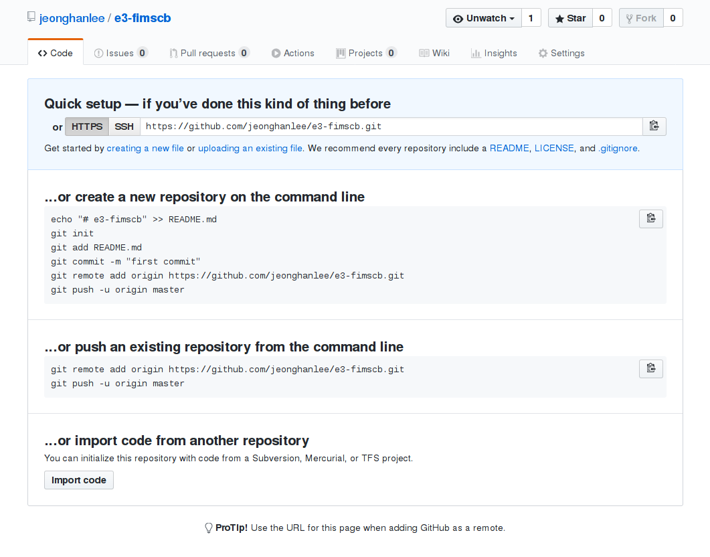
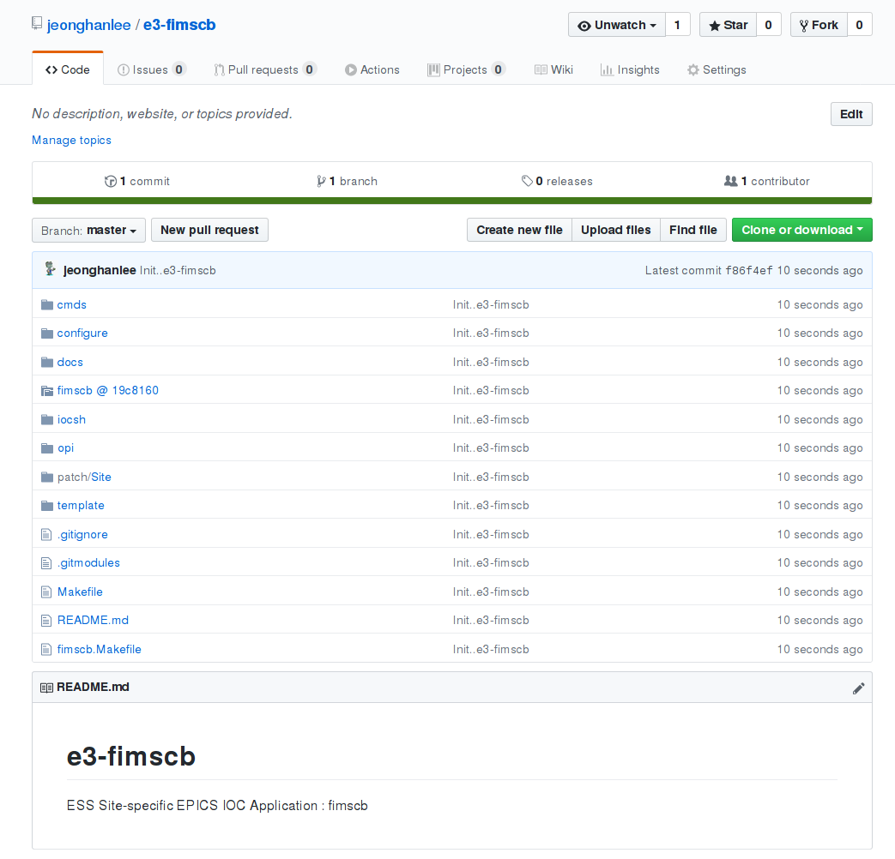
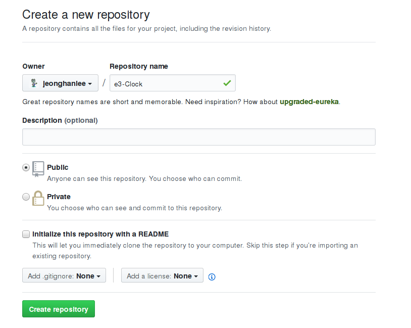
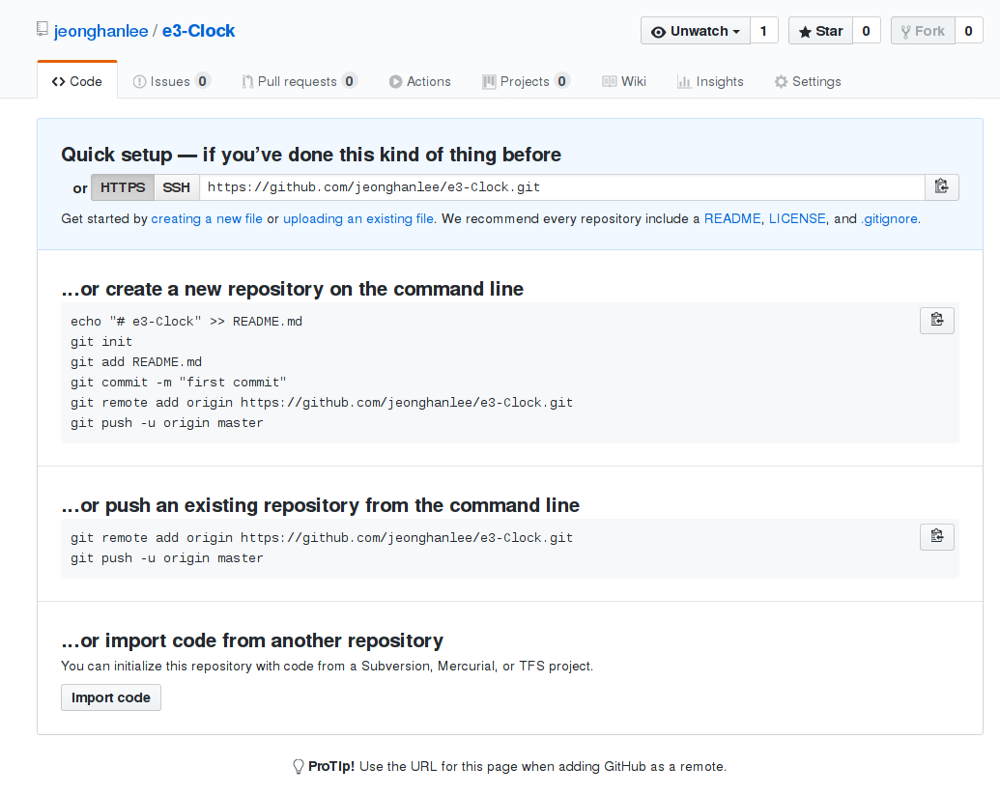

Chapter 8 : Build an e3 Application
==

## Lesson Overview

In this lesson, you'll learn how to do the following:
* Understand the difference between e3 Modules and its Applications
* Understand the e3 installation directory structure
* Can create an e3 application with a remote source repository with e3TemplateGenerator
* Can create an e3 application with local source files with e3TemplateGenerator
* Can edit a module makefile in order to build, and install its application into e3


## Modules, Applications, and IOCs

There is no clear boundary among modules, applications, and IOCs. Thus, we should define them according to what we would like to distinguish. However, to use them differently gives us more clear ideas how to handle the entire system concisely in terms of the ESS lifecycle. 

### Modules 
We can define generic EPICS modules, which we usually get from the EPICS community or in-house development. For example, `iocStats`, `mrfioc2`, `asyn`, or `autosave`. The installation location is defined as `E3_SITEMODS_PATH` discussed before in [Chapter 6](chapter6.md). The corresponding symbolic links are created within `E3_SITELIBS_PATH`. **Modules** within e3 are the core component in order to build a specific EPICS application. And in order to build the system IOC, one may need to combine **Modules** and **Applications** altogether. One needs to design e3-module_name repository and setup them via `e3TemplateGenerator`. We will discuss this subject in [Chapter 9](chapter9.md) and one can `require` any modules within e3. 


* Check `E3_SITEMODS_PATH`

We assume that one should be in **E3_TOP**. 
```
 e3-3.15.5 (master)$ source tools/setenv
 e3-3.15.5 (master)$ echo ${E3_SITEMODS_PATH}
 e3-3.15.5 (master)$ tree -L 2 ${E3_SITEMODS_PATH}
```

We can check `E3_SITELIBS_PATH` also.
```
e3-3.15.5 (master)$ echo ${E3_SITELIBS_PATH}
e3-3.15.5 (master)$ tree -L 4 ${E3_SITELIBS_PATH}
```

### Applications

We can define applications within e3 as a module which has customized features, i.e., unique sequencer files, and database files for an unique system. One needs to design e3-module_name repository and setup them via `e3TemplateGenerator` and one can `require` any application within e3. 

* Check `E3_SITEAPPS_PATH`

```
 e3-3.15.5 (master)$ echo ${E3_SITEMODS_PATH}
 e3-3.15.5 (master)$ tree -L 4 ${E3_SITEAPPS_PATH}
```

If one doesn't know which category can used for EPICS module or IOC, we can define that this case is in the **applications** if we have to install binary and scripts, or compile source files. In most cases, we can use the applications. 


### IOCs

With e3, IOC has only start up scripts. It may has its own repository, but not necessary to be generated by using `e3TemplateGenerator`. 


## How to build an Application

There are many scenarios to build an application. However, we explain few scenarios, because one can customize it once one understand them correctly. And we introduce few **ACTION**s which help users how to build an application by using `e3Templategenerator`. 

Before finding the correct **ACTION**, one has to ask oneself the following questions:

### Questions 

- **Q00** : Do you have source codes?
  - YES : Go to Q01
  - NO  : Go to Q03

- **Q01** : Is your source codes in a remote (git) repository?
  - YES : Go to Q10
  - NO  : You have source codes locally, Go to Q02

- **Q02** : Do you want to keep these source codes in a separated remote repository? 
  - YES : Create your own repository, and push all local files to that repository. And go to ACTION 1
  - NO  : ACTION 2

- **Q03** : You don't have any source codes, in this case, I would recommend to use the standard EPICS structure. Do you want to accept this suggestion? 
  - YES : Follow ACTION 3, and then go to Q02
  - NO : Follow ACTION 2, and put all source files into application-loc path

- **Q10** : Do you want to keep the old repository with its original forms?
  - YES : Follow ACTION 1
  - NO : ACTION 0


### ACTIONS 

- **ACTION 1** : this ACTION has the following answers in Questions : Q00(YES), Q01(YES), and Q10(YES). We will use one EPICS Application [1] has the standard EPICS Application or IOC structure. We highly recommend users to use the standard EPICS structure, because it gives us backward compatiablity to the standard EPICS if we, EPICS community, or both need it. 

  - Download e3-tools, please remember README.md [2] is your friend. Please spend some time in order to look around within. 
   ```
   $ mkdir ${HOME}/ics_gitsrc
   $ cd ${HOME}/ics_gitsrc
   $ git clone https://github.com/icshwi/e3-tools
   $ cd e3-tools/e3TemplateGenerator/
   $ e3TemplateGenerator (master)$ tree -L 2
     .
     ├──  e3TemplateGenerator.bash
     ├──  modules_conf
     │   ├──  caputlog.conf
     │   ├──  genesysGEN5kWPS.conf
     │   ├──  local.conf
     │   ├──  localexample.conf
     │   └──  MCoreUtils.conf
     └──  README.md
   ```
  - Check `modules_conf/genesysGEN5kWPS.conf`
   ```
   e3TemplateGenerator (master)$ more modules_conf/genesysGEN5kWPS.conf 
   EPICS_MODULE_NAME:=genesysGEN5kWPS
   EPICS_MODULE_URL:=https://github.com/icshwi
   E3_TARGET_URL:=https://github.com/icshwi
   E3_MODULE_SRC_PATH:=genesysGEN5kWPS
   ```

  - Four Varialbes one should understand. Two variables `EPICS_MODULE_NAME` and `E3_MODULE_SRC_PATH` are already defined in [Chapter 6](chapter6.md)
    - `EPICS_MODULE_NAME` : used for the E3 module name, where one use it as its name
	- `EPICS_MODULE_URL`  : shown as the module source repoistory URL
	- `E3_TARGET_URL`     : used for the E3 module repository 
	- `E3_MODULE_SRC_PATH`: shown as the source code directory name in `EPICS_MODULE_URL`

    The remote repository url of the source files is `https://github.com/icshwi/genesysGEN5kWPS`. Thus, the remote repository url can be translated into `EPICS_MODULE_URL/E3_MODULE_SRC_PATH`.
	

  - Run the following command :
    ```
	 e3TemplateGenerator (master)$ ./e3TemplateGenerator.bash -m modules_conf/fimscb.conf -d ~/e3-trainings/siteApps
	 >>
	 fimscb is used as module name.

	 >>
	 >> Your sources are located in https://github.com/icshwi.
	 >> git submodule will be used.
	 >> 
	 EPICS_MODULE_NAME  : fimscb
	 E3_MODULE_SRC_PATH : fimscb
	 EPICS_MODULE_URL   : https://github.com/icshwi
	 E3_TARGET_URL      : https://github.com/jeonghanlee
	 >> 
	 e3 module name     : e3-fimscb
	 e3 module url full : https://github.com/icshwi/fimscb
	 e3 target url full : https://github.com/jeonghanlee/e3-fimscb.git
	 >> 
	 Initialized empty Git repository in /home/jhlee/e3-trainings/siteApps/e3-fimscb/.git/
	 https://github.com/icshwi/fimscb is adding as submodule...
	 Cloning into 'fimscb'...
	 X11 forwarding request failed on channel 0
	 remote: Enumerating objects: 122, done.
	 remote: Total 122 (delta 0), reused 0 (delta 0), pack-reused 122
	 Receiving objects: 100% (122/122), 31.29 KiB | 0 bytes/s, done.
	 Resolving deltas: 100% (38/38), done.
	 Checking connectivity... done.
	 add ignore = dirty ... 

	 Submodule 'simulator/kameleon' (https://github.com/jeonghanlee/kameleon.git) registered for path 'simulator/kameleon'
	 Cloning into 'simulator/kameleon'...
	 X11 forwarding request failed on channel 0
	 remote: Enumerating objects: 581, done.
	 remote: Total 581 (delta 0), reused 0 (delta 0), pack-reused 581
	 Receiving objects: 100% (581/581), 824.14 KiB | 0 bytes/s, done.
	 Resolving deltas: 100% (295/295), done.
	 Checking connectivity... done.
	 Submodule path 'fimscb/simulator/kameleon': checked out '84065a07c9cf12e094ef13e3fd359a001a55a28b'

	 >>>> Do you want to add the URL https://github.com/jeonghanlee/e3-fimscb.git for the remote repository?
		  In that mean, you already create an empty repository at https://github.com/jeonghanlee/e3-fimscb.git.
	      If yes, the script will push the local e3-fimscb to the remote repository. (y/N)? 
	```
  - Type N	or Enter
    ```
		>>>> Skipping add the remote repository url. 
             And skipping push the e3-fimscb to the remote also.

	   In case, one would like to push this e3 module to git repositories,
	   Please use the following commands within e3-fimscb/ :

          * git remote add origin https://github.com/jeonghanlee/e3-fimscb.git
		  * git commit -m "First commit"
		  * git push -u origin master

       The following files should be modified according to the module : 

          * /home/jhlee/e3-trainings/siteApps/e3-fimscb/configure/CONFIG_MODULE
		  * /home/jhlee/e3-trainings/siteApps/e3-fimscb/configure/RELEASE
		  * /home/jhlee/e3-trainings/siteApps/e3-fimscb/fimscb.Makefile

       One can check the e3- template works via 
          cd /home/jhlee/e3-trainings/siteApps/e3-fimscb
		  make init
		  make vars
    ```
	
  - Check how `e3-genesysGEN5kWPS`, which can be translated into `e3-EPICS_MODULE_NAME`
  
    ```
	e3TemplateGenerator (master)$ cd e3-genesysGEN5kWPS/ 
	e3-genesysGEN5kWPS (master)$ tree -L 1   
	.
	|-- cmds
	|-- configure
	|-- docs
	|-- genesysGEN5kWPS                         ---> E3_MODULE_SRC_PATH
	|-- iocsh
	|-- opi
	|-- patch
	|-- template
	|-- genesysGEN5kWPS.Makefile                ---> EPICS_MODULE_NAME.Makefile
	|-- Makefile
	`-- README.md
	```
	
  - What do you see? And do you understand how we use the above four variables? Even if you cannot find the answer yet, don't worry about it. We can find answers later. And before going to a real exercise, please try to answer the following questions:
    - We selected `N` or `Enter` to skip to push the local e3-genesysGEN5kWPS to the remote repository `https://github.com/icshwi/e3-genesysGEN5kWPS`, can you translated the remote repository url by using some of four variables?
	
	- What if `Y` is selected? 
	  Are you ready to see? Please try the following commands:
	  
	  ```
	  e3TemplateGenerator (master)$ rm -rf e3-genesysGEN5kWPS/
	  e3TemplateGenerator (master)$ ./e3TemplateGenerator.bash -m modules_conf/genesysGEN5kWPS.conf
	  
      ......
	  ......

	  >>>> Do you want to add the URL https://github.com/icshwi/e3-genesysGEN5kWPS.git for the remote repository?
		   In that mean, you already create an empty repository at https://github.com/icshwi/e3-genesysGEN5kWPS.git.
		   If yes, the script will push the local e3-genesysGEN5kWPS to the remote repository. (y/N)? y

      >>>> Repository exists!!!     Are you sure this is your first push?
	       You should aware what you are doing now ....
           If you are not sure, please stop this procedure immediately!

      >> Do you want to continue (y/N)? 
	  ```
	  Yes, the remote repository for `https://github.com/icshwi/e3-genesysGEN5kWPS` exists, so it will ask us one more question. If you select `N` or `enter`, it will print out the following messages:
	  ```
	  >> Skip here. 

      >>>> Skipping add the remote repository url. 
           And skipping push the e3-genesysGEN5kWPS to the remote also.

      In case, one would like to push this e3 module to git repositories,
      Please use the following commands within e3-genesysGEN5kWPS/ :

         * git remote add origin https://github.com/icshwi/e3-genesysGEN5kWPS.git
		 * git commit -m "First commit"
		 * git push -u origin master

	  ```
	   
	  If you select `y`, which means that this push is the first one. In this case you can push the just created e3 structure into the repository. We will explain this more with the real example later.  You may try to select `y` to see how it works if you want. Now let's do one real example.
	  
  - Build an e3 application, with the remote repository [1].
  
    - **ACTION 1.1** Define four variables in fimscb.conf as follows:
	  ```
	  EPICS_MODULE_NAME:=fimscb
	  EPICS_MODULE_URL:=https://github.com/icshwi
	  E3_TARGET_URL:=https://github.com/jeonghanlee
	  E3_MODULE_SRC_PATH:=fimscb
	  #
	  ```
	- **ACTION 1.2** Create the e3-fimscb in your target url. In this example, the target url `E3_TARGET_URL` is https://github.com/jeonghanlee. Note that you have the write permission for `E3_TARGET_URL`. 
	  
      |                           |
      | :---:                                                                               |
      | **Figure 8.1** The screenshot for the before repository creation based on `E3_TARGET_URL`. Note that no options are selected. |

      |                           |
      | :---:                                                                               |
      | **Figure 8.2** The screenshot for the after repository creation. |
	
	- Run e3TemplateGenerator.bash with that file
	  ```
	  e3TemplateGenerator (master)$ ./e3TemplateGenerator.bash -m modules_conf/fimscb.conf -d ~/e3-trainings/siteApps
	  
	  ......
	  ......
	  
	  The following files should be modified according to the module : 

         * /home/jhlee/e3-trainings/siteApps/e3-fimscb/configure/CONFIG_MODULE
		 * /home/jhlee/e3-trainings/siteApps/e3-fimscb/configure/RELEASE
		 * /home/jhlee/e3-trainings/siteApps/e3-fimscb/fimscb.Makefile

      One can check the e3- template works via 
	      cd /home/jhlee/e3-trainings/siteApps/e3-fimscb
	      make init
       	  make vars

	  ```
	  , where `-d` option allows us to define the target directory which has e3-fimscb locally. And Please select `y` to push all changes into `E3_TARGET_URL`/e3-`EPICS_MODULE_NAME`. Can you see the same result shown in Figure 8.3?
	  	  
      |                           |
      | :---:                                                                               |
      | **Figure 8.3** The screenshot for the repository after the first push all codes. |

	- **ACTION 1.3** Check your created e3 application. `e3-fimscb` is located in `${HOME}/e3-trainings/siteApps` now. 
	  ```
	  e3TemplateGenerator (master)$ tree -L 1 ~/e3-trainings/siteApps/e3-fimscb
	  e3TemplateGenerator (master)$ make -C  ~/e3-trainings/siteApps/e3-fimscb/ vars
	  ```
	  
	- **ACTION 1.4** Modifiy few files in order to build, and install them within the existent e3 environment. 
	  ```
	  e3TemplateGenerator (master)$ cd ~/e3-trainings/siteApps/e3-fimscb/
	  e3-fimscb (master)$ make init
	  ```
	  Now you have the e3 structure and its configuration. The next step is to change few files. There are three files you should change. The `configure/CONFIG_MODULE` and `configure/RELEASE` were discussed in eariler chapters. The most important thing is `fimscb.Makefile`, which is genenerated by `e3TemplateGenerator` and has only default options. Please edit the makefile as follows:
	  ```
	  where_am_I := $(dir $(abspath $(lastword $(MAKEFILE_LIST))))
	  include $(E3_REQUIRE_TOOLS)/driver.makefile
	  include $(E3_REQUIRE_CONFIG)/DECOUPLE_FLAGS

	  APP:=fimscbApp
	  APPDB:=$(APP)/Db

      TEMPLATES += $(APPDB)/fimscb.db
      TEMPLATES += $(APPDB)/fimscb.proto

      db:

	  .PHONY: db 

      vlibs:

      .PHONY: vlibs
	  ```
	  Let's build `e3-fimscb` now. 
	  ```
	  e3-fimscb (master)$ make build
	  e3-fimscb (master)$ make install
	  e3-fimscb (master)$ make existent LEVEL=3
	  /epics/base-3.15.5/require/3.0.4/siteApps/fimscb
	  └── master
      ├── db
      │   ├── fimscb.db
      │   └── fimscb.proto
      └── lib
		  └── linux-x86_64
	  ```
	 
	  Let's explore it witin `iocsh.bash`. With latest require configuration, one can execute the iocsh.bash if one knows the exact path, such as 
	  ```
	  $ bash /epics/base-3.15.5/require/3.0.4/bin/iocsh.bash 
	  ```
	  If not, please go to **E3_TOP**, and `source tools/setenv`.  Let's assume that you are in iocsh.bash such as 
	  ```
	  effbc10.kaffee.4837 > 
	  effbc10.kaffee.4837 > require fimscb,master
	  Module fimscb version master found in /epics/base-3.15.5/require/3.0.4/siteApps/fimscb/master/
	  Module fimscb has no library
	  effbc10.kaffee.4837 > require fimscb,master
	  Module fimscb version master already loaded
	  effbc10.kaffee.4837 > cd $(fimscb_DB)
	  effbc10.kaffee.4837 > system (ls)
	  effbc10.kaffee.4837 > pwd
	  ```
	  Here you can find answers for one of assignments in [Chapter 6](chapter6.md). 

	- **ACTION 1.5** Commit your changes into the e3 remote repository.
	  ```
	  e3-fimscb (master)$ git status
	  .....
           modified:   fimscb.Makefile
	  e3-fimscb (master)$ git add fimscb.Makefile
	  e3-fimscb (master)$ git commit -m "update makefile"
	  e3-fimscb (master)$ git push
	  ```
 
	 
- **ACTION 2** : e3TemplateGenerator with the local mode 
  There are many ways one can hold files within e3. Here I would like to show the most recommand way. This is not the mandatory, but you will see the potential advantage in near future if you works with local files in long time. Here is the _fake_ scenario: I find the interesting EPICS application which I would like to integrate into e3. And I don't know how I can handle these source files, because the file is _tar.gz_ file. However, I would like to change their source codes while I am going to study them. 
  
  - Build an e3 application, with the local files that can be downloaded from the original site [3].
  
    - **ACTION 2.1**  Define three variables in Clock.conf as follows:
	  ```
	  EPICS_MODULE_NAME:=Clock
	  E3_TARGET_URL:=https://github.com/jeonghanlee
	  E3_MODULE_SRC_PATH:=Clock
	  #
	  ```
    - **ACTION 2.2**  Create e3-Clock in your target url. In this example, the target url `E3_TARGET_URL` is  https://github.com/jeonghanlee. Note that you have the write permission for `E3_TARGET_URL`. 
      |       |
      | :---:                                                                                                                         |
      | **Figure 8.4** The screenshot for the before repository creation based on `E3_TARGET_URL`. Note that no options are selected. |

      |       |
      | :---:                                                            |
      | **Figure 8.5** The screenshot for the after repository creation. |

	  - Run e3TemplateGenerator.bash with that file
	    ```
	    e3TemplateGenerator (master)$ ./e3TemplateGenerator.bash -m modules_conf/Clock.conf -d ~/e3-trainings/siteApps/
		>>
		Clock is used as module name.

		>>
		>> Your sources are located in e3-Clock.
		>> 
		EPICS_MODULE_NAME  : Clock
		E3_MODULE_SRC_PATH : Clock
		E3_TARGET_URL      : https://github.com/jeonghanlee
		>> 
		e3 module name     : e3-Clock
		e3 target url full : https://github.com/jeonghanlee/e3-Clock.git
		>> 
		Initialized empty Git repository in /home/jhlee/e3-trainings/siteApps/e3-Clock/.git/
		Clock-loc
		
		>>>> Do you want to add the URL https://github.com/jeonghanlee/e3-Clock.git for the remote repository?
		In that mean, you already create an empty repository at https://github.com/jeonghanlee/e3-Clock.git.
		If yes, the script will push the local e3-Clock to the remote repository. (y/N)? y
		
		>>>> Repository exists!!!     Are you sure this is your first push?
		You should aware what you are doing now ....
		If you are not sure, please stop this procedure immediately!
		
		>> Do you want to continue (y/N)? y

		>>>> We are going to the further process ...... [master (root-commit) 13536c5] Init..e3-Clock
		
		......
		......

		To git@github.com:jeonghanlee/e3-Clock.git
		* [new branch]      master -> master
		Branch master set up to track remote branch master from origin.


		The following files should be modified according to the module : 

		* /home/jhlee/e3-trainings/siteApps//e3-Clock/configure/CONFIG_MODULE
		* /home/jhlee/e3-trainings/siteApps//e3-Clock/configure/RELEASE
		* /home/jhlee/e3-trainings/siteApps//e3-Clock/Clock.Makefile

		One can check the e3- template works via 
		cd /home/jhlee/e3-trainings/siteApps//e3-Clock
		make init
		make vars

		```
    - **ACTION 2.3** Check your created e3 application. `e3-Clock` is located in `${HOME}/e3-trainings/siteApps` now. 
	  ```
	  e3TemplateGenerator (master)$ cd  ~/e3-trainings/siteApps/e3-Clock/
	  e3-Clock (master)$ tree -L 1
	  .
	  |-- Clock-loc
	  |-- cmds
	  |-- configure
	  |-- docs
	  |-- iocsh
	  |-- opi
	  |-- patch
	  |-- template
	  |-- Clock.Makefile
	  |-- Makefile
	  `-- README.md
	  ```
	  The structure is the exact same as **ACTION 1** except **Clock-loc**. In that directory, now, you can copy or extract all your codes. 
	  ```
	  e3-Clock (master)$ cd Clock-loc/
	  Clock-loc (master)$ wget -c http://www-linac.kek.jp/cont/epics/second/second-devsup.tar.gz
	  Clock-loc (master)$ tar xvzf second-devsup.tar.gz
	  ```
	  The source codes has `Clock1App` instead of `ClockApp`. We can use either Clock1App or ClockApp. Here, I will use `Clock1App`, so 
	  ```
	  Clock-loc (master)$ rm -rf ClockApp/
	  ```
	  And check what they are in that path, and go back to e3-Clock
	  ```
	  Clock-loc (master)$ tree Clock1App/
	  Clock-loc (master)$ cd ..
	  e3-Clock  (master)$ make vars
	  ```
	  One can check `git status` also. 
		
	- **ACTION 2.4** Modifiy few files in order to build, and install them within the existent e3 environment. 
	  The initization command or rule has no effect on the local mode. 
	  ```
	  e3-Clock (master)$ make init
      >> You are in the local source mode.
      >> Nothing happens.
	  ```
	  Now you have the e3 structure and its configuration. The next step is to change few files. There are three files you should change. The `configure/CONFIG_MODULE` and `configure/RELEASE` were discussed in eariler chapters. The most important thing is `Clock.Makefile`, which is genenerated by `e3TemplateGenerator` and has only default options. Please edit the makefile as follows:		
      ```
	  where_am_I := $(dir $(abspath $(lastword $(MAKEFILE_LIST))))
	  include $(E3_REQUIRE_TOOLS)/driver.makefile
	  include $(E3_REQUIRE_CONFIG)/DECOUPLE_FLAGS

	  APP:=Clock1App
	  APPDB:=$(APP)/Db
	  APPSRC:=$(APP)/src

	  USR_INCLUDES += -I$(where_am_I)$(APPSRC)

	  TEMPLATES += $(wildcard $(APPDB)/*.db)

	  SOURCES += $(APPSRC)/devAiSecond.c

	  DBDS += $(APPSRC)/aiSecond.dbd

	  db: 

	  .PHONY: db 

	  vlibs:

	  .PHONY: vlibs

	  ```
	  Let's build `e3-Clock` now. 
	  ```
	  e3-Clock (master)$ make build
	  e3-Clock (master)$ make install
	  e3-Clock (master)$ make existent LEVEL=4
	  /epics/base-3.15.5/require/3.0.4/siteApps/Clock
	  └── master
			├── db
			│   └── aiSecond.db
			├── dbd
			│   └── Clock.dbd
			└── lib
				└── linux-x86_64
					├── Clock.dep
					└── libClock.so

	  ```
	  Let's explore it witin `iocsh.bash`. With latest require configuration, one can execute the iocsh.bash if one knows the exact path, such as 
	  ```
	  $ bash /epics/base-3.15.5/require/3.0.4/bin/iocsh.bash 
	  ```
	  If not, please go to **E3_TOP**, and `source tools/setenv`.  Let's assume that you are in iocsh.bash such as 
	  ```
	  effbc10.kaffee.10034 > 
	  effbc10.kaffee.10034 > require Clock,master
	  Module Clock version master found in /epics/base-3.15.5/require/3.0.4/siteApps/Clock/master/
	  Loading library /epics/base-3.15.5/require/3.0.4/siteApps/Clock/master/lib/linux-x86_64/libClock.so
	  Loaded Clock version master
	  Loading dbd file /epics/base-3.15.5/require/3.0.4/siteApps/Clock/master/dbd/Clock.dbd
	  Calling function Clock_registerRecordDeviceDriver
	  ```
	- **ACTION 2.5** Commit your changes into the e3 remote repository.

- **ACTION 3** : Create your source structure with the standard EPICS way


- **ACTION 0** : You need to define how you migrate them into e3 template. The recommendation is to move them all into a local path, and do ACTION 2. If you don't like this recommendation, please contact the e3 mailing list or create the JIRA issue to get some helps. 


  


<!-- ### EPICS Standard Strcuture with a remote repository -->

<!-- ### Existent EEE Structure with a remote repository -->

<!-- ### From scratch  -->

<!-- * Would like to keep the standard structure?  -->
<!-- * Would like to keep all into e3 local structure? -->
<!-- * Would like to keep them seperated remote repository with e3 structure? -->

<!-- ## Type 1 : To develop an e3 IOC quickly within e3 application structure -->

<!-- * Application with DB and Protocol Files with the existent EPICS IOC -->
<!-- * Application with DB and Protocol Files from scratch  -->

<!-- ## Type 2 :To develop an e3 IOC within e3 application structure -->

<!-- ### Type 2.1 : Application with DB and Protocol Files with the existent EPICS IOC -->
<!-- ### Type 2.2 : Source and Sequencer files based on Type 2.1 -->


<!-- ## Type 2 : -->

<!-- https://github.com/icshwi/fimscb -->


<!-- ## Type 2 : Application with S -->

## Reference
[1] https://github.com/icshwi/fimscb : EPICS IOC for ESS RF FIM SCB Monitoring System  
[2] [e3TemplateGenerator README.md](https://github.com/icshwi/e3-tools/tree/master/e3TemplateGenerator)
[3] http://www-linac.kek.jp/cont/epics/second/second-devsup.tar.gz
------------------
[:arrow_backward:](chapter7.md)  | [:arrow_up_small:](chapter8.md)  | [:arrow_forward:](chapter9.md)
:--- | --- |---: 
[Chapter 7 : Understand A Module Dependence](chapter7.md) | [Chapter 8](chapter8.md) | [Chapter 9 : Build an e3 module](chapter9.md)
